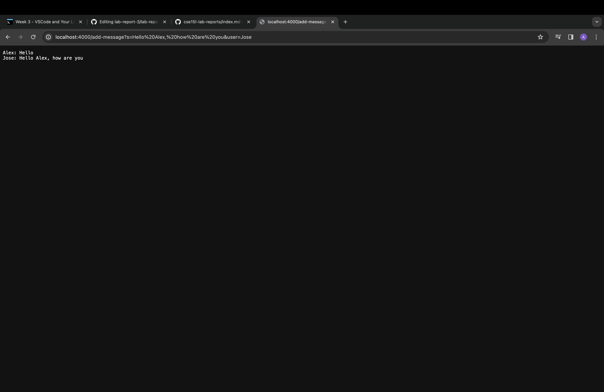

# CSE 15L Lab Report 3
## Part 1
```
class Handler implements URLHandler {
    String messages = "";
    public String handleRequest(URI url) {
        String message = "", user = "";
        if (url.getPath().equals("/")) {
            return String.format("Nothing yet!");
        } else {
            if (url.getPath().contains("/add-message")) {
                String[] parameters = url.getQuery().split("=");
                if (parameters[0].equals("s")) {
                    int i = 1;
                    while (!parameters[i].contains("&")) {
                        message = parameters[i] + " ";
                        i++;
                    }
                    String[] parse = parameters[i].split("&");
                    message = message + parse[0];
                    i++;
                    while(i < parameters.length) {
                        user = parameters[i];
                        i++;
                    }
                }
                messages = messages + user + ": " + message + '\n' ;
                return messages;
            }
            return "404 Not Found!";
        }
    }
}

class ChatServer {
    public static void main(String args[]) throws IOException {
        if(args.length == 0){
            System.out.println("Missing port number! Try any number between 1024 to 49151");
            return;
        } 
        int port = Integer.parseInt(args[0]);
        Server.start(port, new Handler());
    }
}
```


The methods in my code that are called are handleRequest, getPath, equals, getQuery, split and format.
The relevant argument for handleRequest is a url. The rest need a string for an argument.
The values of message and user did not change because there has only been one user and message added. 


The methods in my code that are called are handleRequest, getPath, equals, getQuery, split and format.
The relevant argument for handleRequest is a url. The rest need a string for an argument.
The values of message and user get changed each time /add-message is in the url and the server is visited. 
The value of messages does not change and it keeps track of all new messages.

## Part 2


## Part 3
From lab 2 I learned how to log in to another computer remotely and host a server from a computer.
In lab 3 I learned how to do the same, but from my own computer and host a server locally. I also learned how I can add things to the website such
as a counter, or chat logs.
